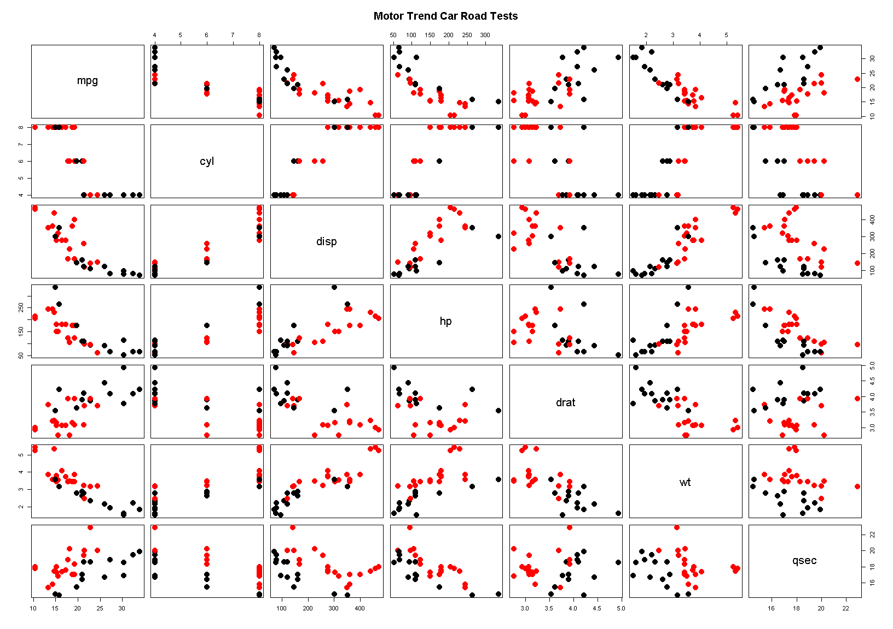

# Regression Models Course Project
phobos  
Sunday, November 23, 2014  

##### The data
- Motor Trend Car Road Tests: The data was extracted from the 1974 Motor Trend US magazine, and comprises fuel consumption and 10 aspects of automobile design and performance for 32 automobiles (1973-74 models).

```r
head(mtcars,3)
```

```
##                mpg cyl disp  hp drat    wt  qsec vs am gear carb
## Mazda RX4     21.0   6  160 110 3.90 2.620 16.46  0  1    4    4
## Mazda RX4 Wag 21.0   6  160 110 3.90 2.875 17.02  0  1    4    4
## Datsun 710    22.8   4  108  93 3.85 2.320 18.61  1  1    4    1
```
A data frame with 32 observations on 11 variables.

Variables |Description
----------|-------------
mpg       |Miles/(US) gallon
cyl       |Number of cylinders
disp      |Displacement (cu.in.)
hp        |Gross horsepower
drat      |Rear axle ratio
wt        |Weight (lb/1000)
qsec      |1/4 mile time
va        |V/S
am        |Transmission (0 = automatic, 1 = manual
gear      |Number of forward gears
carb      |Number of carburetors


- Graph data some variables according to the type of transmission. The automatic transmission in red and The manual transmission in black

```r
pairs(mtcars[,1:7], main = "Motor Trend Car Road Tests", col = 1 + (mtcars$am == 0), pch = 19,cex = 2)
```

 


- Looking at a data set of a collection of cars, they are interested in exploring the relationship between a set of variables and miles per gallon (MPG) (outcome). They are particularly interested in the following two questions:  

**"Is an automatic or manual transmission better for MPG"**  


```r
mean(mtcars$mpg[mtcars$am==1])
```

```
## [1] 24.39231
```

```r
mean(mtcars$mpg[mtcars$am==0])
```

```
## [1] 17.14737
```
The manual transmission **24.3923077** better than the automatic transmission **17.1473684** for Miles/(US) gallon

**"Quantify the MPG difference between automatic and manual transmissions"**


```r
mean(mtcars$mpg[mtcars$am==1]) - mean(mtcars$mpg[mtcars$am==0])
```

```
## [1] 7.244939
```

The difference between manual and automatic transmission is **7.2449393** Miles/(US) gallon

